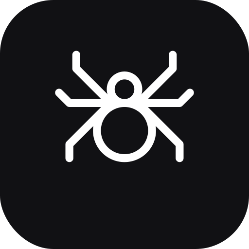
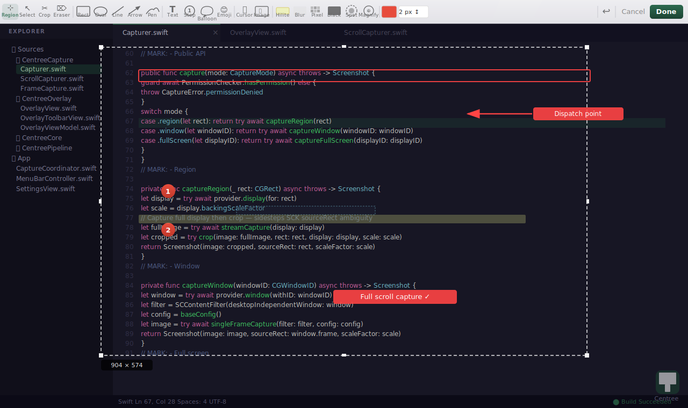

<p align="center">
  
</p>

<h1 align="center">Reticle</h1>

<p align="center">
  A free, open-source screenshot tool for macOS — built for people who take screenshots seriously.
</p>

<p align="center">
  <a href="https://github.com/croc100/Reticle/actions/workflows/ci.yml">
    
  </a>
  
  
  
  
</p>

<p align="center">
  
</p>

---

## What is Reticle?

Reticle is a **macOS-native screenshot tool** that brings the full power of [ShareX](https://getsharex.com/) — the gold standard on Windows — to macOS.

Most macOS screenshot tools are either too simple (built-in Screenshot.app) or too expensive (CleanShot X at $29). Reticle is **completely free and open source**, with a ShareX-style annotation toolbar, workflow automation, and cloud upload built in from day one.

> **Pricing:** Free for everyone. Yes, everyone. Well — *almost* everyone.  
> **기엽이는 유료입니다.** 기엽아, 이거 쓰려면 커피 한 잔 사와. ☕

---

## Features

### Capture

| Feature | Status |
|---|:---:|
| Region capture (freeze + annotate) | ✅ |
| Full-screen capture | ✅ |
| Per-monitor capture | ✅ |
| Window capture (click-to-pick) | ✅ |
| Scrolling screenshot | ✅ |
| Last region repeat | ✅ |
| Saved regions | ✅ |
| Auto capture (interval timer) | ✅ |
| Capture delay (countdown) | ✅ |
| ShareX-style instant capture (drag or click) | ✅ |

### Annotation Tools

21 tools, ShareX-style toolbar that slides in from the top of the frozen screen.  
Each tool is **sticky** — stays active until you switch to another.

| Tool | Notes |
|---|---|
| Rectangle / Ellipse | Solid / dashed / dotted stroke |
| Line / Arrow | Solid / dashed / dotted, angle-snap with Shift |
| Freehand pen | Smooth cardinal spline |
| Freehand arrow | |
| Text | Outline, background variants |
| Step numbers | Auto-increments, drag to add leader line |
| Speech balloon | Click-through text input |
| Highlight | Defaults to fluorescent yellow, adjustable opacity |
| Blur (Gaussian) | Live preview, expanded-crop for edge accuracy |
| Pixelate | Live preview |
| Blackout | |
| Spotlight | Dark overlay with circular reveal |
| Magnify / Loupe | Circular magnifier with configurable scale |
| Emoji / Sticker | |
| Mouse cursor stamp | |
| Image insert | |
| Ruler | With scale readout |
| Crop | Non-destructive selection crop |
| Eraser | Smart: trims pen strokes point-by-point |
| Select / Move | Rotate, resize, multi-select with Shift |

### After Capture

| Action | Status |
|---|:---:|
| Copy to clipboard | ✅ |
| Save to file (configurable path + filename tokens) | ✅ |
| Desktop notification with thumbnail | ✅ |
| OCR — extract text via Vision framework | ✅ |
| Pin to screen (floating image overlay) | ✅ |
| Open in viewer | ✅ |
| Reveal in Finder | ✅ |
| Copy file path | ✅ |

### Uploads

| Destination | Status |
|---|:---:|
| Imgur | ✅ |
| Amazon S3 / Backblaze B2 / Cloudflare R2 | ✅ |
| FTP / SFTP | ✅ |
| Custom HTTP uploader (JSON-defined) | ✅ |
| Google Drive / Dropbox | 🔜 |
| URL shortener | 🔜 |

### Utilities

| Tool | Status |
|---|:---:|
| Screen color picker (loupe + HEX copy) | ✅ |
| Clipboard history (⌘⇧V, last 30 items) | ✅ |
| OCR result panel | ✅ |
| Workflow profiles (hotkey → capture mode → upload) | ✅ |
| Customizable global hotkeys | ✅ |

---

## Why Reticle?

### vs. the competition

| | Reticle | CleanShot X | Shottr | Snagit | Flameshot |
|---|:---:|:---:|:---:|:---:|:---:|
| **Price** | **Free** | $29 one-time | Free | $62/year | Free |
| **Open source** | ✅ | ❌ | ❌ | ❌ | ✅ |
| ShareX-style annotation | ✅ | ❌ | ❌ | partial | ❌ |
| Sticky tool mode | ✅ | ❌ | ❌ | ✅ | ✅ |
| Live blur / pixelate preview | ✅ | ✅ | ✅ | ✅ | ✅ |
| Line style (solid/dashed/dotted) | ✅ | ❌ | ❌ | ✅ | ❌ |
| Scrolling screenshot | ✅ | ✅ | ❌ | ✅ | ❌ |
| Window picker (click-to-capture) | ✅ | ✅ | ✅ | ✅ | ❌ |
| Color picker | ✅ | ✅ | ✅ | ✅ | ❌ |
| Clipboard history | ✅ | ✅ | ❌ | ❌ | ❌ |
| OCR | ✅ | ✅ | ✅ | ✅ | ❌ |
| Pin to screen | ✅ | ✅ | ❌ | ❌ | ❌ |
| Cloud uploads | ✅ | ✅ | ❌ | ✅ | ❌ |
| Workflow automation | ✅ | partial | ❌ | ✅ | ❌ |
| Pixel-perfect capture | ✅ | ✅ | ✅ | ✅ | ✅ |
| Display P3 color space preserved | ✅ | ✅ | ❓ | ❓ | ❌ |
| **Static Mask (auto-redact regions)** | 🔜 | ❌ | ❌ | ❌ | ❌ |
| **Vision PII auto-detection** | 🔜 | ❌ | ❌ | ❌ | ❌ |

### Reticle vs. ShareX

ShareX is the undisputed best screenshot tool — on Windows. Reticle aims for **feature parity on macOS**, built natively with SwiftUI + AppKit + ScreenCaptureKit rather than a port.

| | Reticle | ShareX (Windows) |
|---|:---:|:---:|
| Native macOS (SwiftUI / AppKit) | ✅ | — |
| Freeze-screen annotation overlay | ✅ | ✅ |
| Instant drag-or-click capture | ✅ | ✅ |
| Annotation toolbar (21 tools) | ✅ | ✅ |
| Workflow / after-capture pipeline | ✅ | ✅ |
| Cloud upload destinations | ✅ | ✅ |
| Screen recording | 🔜 | ✅ |

---

## Coming Soon

- **Screen recording** — GIF & MP4
- **QR code** generate / scan
- **Static Mask** — register regions once, auto-redact on every capture
- **Vision PII detection** — auto-detect emails, phone numbers, API keys, JWTs
- **Watch folder** — auto-process on save
- **Homebrew Cask** — `brew install --cask reticle`
- Signed DMG + Sparkle auto-update

---

## Requirements

- macOS 13 Ventura or later
- Apple Silicon or Intel

## Installation

> Signed DMG and Homebrew coming with v1.0. Build from source until then.

```bash
git clone https://github.com/croc100/Reticle.git
cd reticle
swift build -c release
# Or open Package.swift in Xcode → select ReticleApp scheme → Run
```

Grant **Screen Recording** permission on first launch.  
Grant **Accessibility** permission for scroll capture and hotkey recording.

---

## Keyboard Shortcuts

### Global (works from any app)

| Key | Action |
|---|---|
| `⌘⇧2` | **Reticle Region Capture** — freeze + annotate |
| `⌘⇧3` | macOS full-screen (system default, untouched) |
| `⌘⇧4` | macOS region (system default, untouched) |

### In the annotation overlay

| Key | Action |
|---|---|
| Drag or click window | Instant capture (ShareX-style) |
| `⌘Z` | Undo last annotation |
| `Delete` / `Backspace` | Delete selected annotation |
| `Return` / `Enter` | Finalize and capture |
| `Escape` | Cancel |
| `Shift` + drag | Constrain to square / 45° angle |

---

## Architecture

```
ReticleApp          — Menu bar app, hotkey wiring, capture coordinator
├── ReticleCapture  — ScreenCaptureKit wrapper (region / window / full-screen / scroll)
├── ReticleOverlay  — Full-screen freeze overlay + annotation toolbar (SwiftUI + AppKit)
├── ReticleEffects  — CoreImage blur / pixelate / mask rendering
├── ReticlePipeline — Capture → AfterCapture → Output → AfterOutput task chain
├── ReticleNaming   — Filename token parser (%year%, %counter%, %app%, …)
├── ReticleVision   — Vision framework OCR + PII detector
├── ReticleWorkflow — Hotkey → workflow profile binding
├── ReticleUploaders— Upload adapters (Imgur, S3, custom HTTP, …)
└── ReticleCore     — Shared models, protocols, Defaults keys
```

---

## License

[GNU Affero General Public License v3.0](LICENSE)

Free for open-source use. Commercial use without AGPL compliance requires a separate license.

> 기엽이는 무조건 유료. 협상 없음.

## Contributing

PRs welcome. Open an issue first for large changes.

© Reticle Contributors
